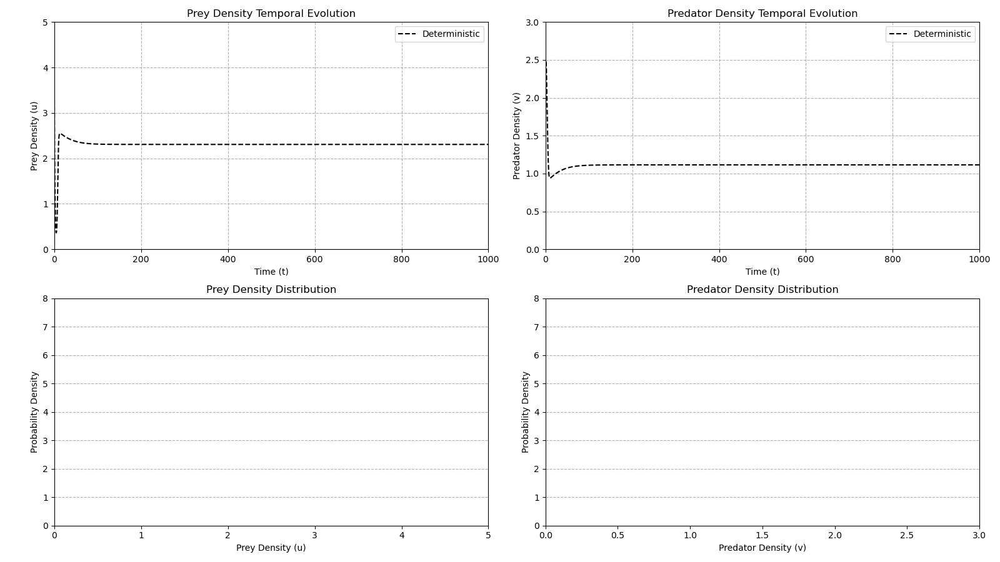

<!-- PROJECT SHIELDS -->
[![Forks][forks-shield]][forks-url]
[![Stargazers][stars-shield]][stars-url]
[![Issues][issues-shield]][issues-url]
[![MIT License][license-shield]][license-url]
[![LinkedIn][linkedin-shield]][linkedin-url]
[![Gmail][gmail-shield]][gmail-url]

<!-- PROJECT LOGO -->
 

  <!--  -->

<h2 align="center">Dynamics of a stochastic predator-prey model  with fear
effect and hunting cooperation</h2>
<h4 align="center">Stochastic Modelling and Simulation Exam</h4>
<h4 align="center">SDIC Master Degree, University of Trieste (UniTS)</h4>
<h4 align="center">2024 - 2025</h4>

  

    
<i>Quick Links:</i>

    <table>
      <tr>
        <td><a href="https://marcotallone.github.io/stochastic-prey-predator/"><strong>Presentation</strong></a></td>
        <td><a href="./notebooks/Stochastic-Prey-Predator.ipynb"><strong>Notebook</strong></a></td>
        <td><a href="https://link.springer.com/article/10.1007/s12190-022-01746-7?fromPaywallRec=false"><strong>Paper</strong></a></td>
      </tr>
    </table>
     
    

<!-- AUTHOR INFO-->
## Author Info

| Name | Surname | Student ID | UniTS mail | Google mail | Master |
|:---:|:---:|:---:|:---:|:---:|:---:|
| Marco | Tallone | SM3600002 | <marco.tallone@studenti.units.it> | <marcotallone85@gmail.com> | **SDIC** |

(<a href="#readme-top">back to top</a>)

<!-- ABOUT THE PROJECT -->
## About The Project

This repository presents a `Python` implementation and numerical simulations study of the work presented by *Haokun Qi and Xinzhu Meng* in [<a href="#ref1">1</a>], based
on the study of the dynamics of a stochastic predator-prey model with fear
effect and hunting cooperation.\
The [notebook](./notebooks/Stochastic-Prey-Predator.ipynb) in the [`notebooks/`](./notebooks/) folder contains a guided presentation and usage example of all the implemented code, with some comments and final observations on the results obtained from simulations. For a fast look at the whole project, you can instead have a look at the available [presentation](https://marcotallone.github.io/stochastic-prey-predator/) linked below.\
The theoretical background behind this project is introduced in the [original paper](https://link.springer.com/article/10.1007/s12190-022-01746-7?fromPaywallRec=false) also linked below and in the references section.

Click on the badges below to access the official paper and the presentation slides:

[![Official Paper][paper-shield]][paper-url]&nbsp;&nbsp;&nbsp;&nbsp;&nbsp;&nbsp;&nbsp;&nbsp;
[![Presentation Slides][presentation-shield]][presentation-url]

(<a href="#readme-top">back to top</a>)

<!-- LICENSE -->
## License

Distributed under the MIT License. See [`LICENSE`](./LICENSE) for more information.

(<a href="#readme-top">back to top</a>)

<!-- REFERENCES -->
## References

[1]
Haokun Qi, Xinzhu Meng,\
*"Dynamics of a stochastic predator-prey model with fear effect and hunting cooperation"*,\
in Journal of Applied Mathematics and Computing, volume 69, pp. 2077–2103,\
2023,\
doi:  [https://doi.org/10.1007/s12190-022-01746-7](https://doi.org/10.1007/s12190-022-01746-7)

(<a href="#readme-top">back to top</a>)

<!-- MARKDOWN LINKS & IMAGES -->
<!-- https://www.markdownguide.org/basic-syntax/#reference-style-links -->
[forks-shield]: https://img.shields.io/github/forks/marcotallone/stochastic-prey-predator.svg?style=for-the-badge
[forks-url]: https://github.com/marcotallone/stochastic-prey-predator/network/members
[stars-shield]: https://img.shields.io/github/stars/marcotallone/stochastic-prey-predator.svg?style=for-the-badge
[stars-url]: https://github.com/marcotallone/stochastic-prey-predator/stargazers
[issues-shield]: https://img.shields.io/github/issues/marcotallone/stochastic-prey-predator.svg?style=for-the-badge
[issues-url]: https://github.com/marcotallone/stochastic-prey-predator/issues
[license-shield]: https://img.shields.io/github/license/marcotallone/stochastic-prey-predator.svg?style=for-the-badge
[license-url]: https://github.com/marcotallone/stochastic-prey-predator/blob/master/LICENSE
[linkedin-shield]: https://img.shields.io/badge/-LinkedIn-blue?style=for-the-badge&logo=linkedin&logoColor=white&colorB=0077B5
[linkedin-url]: https://linkedin.com/in/marco-tallone-40312425b
[gmail-shield]: https://img.shields.io/badge/-Gmail-red?style=for-the-badge&logo=gmail&logoColor=white&colorB=red
[gmail-url]: mailto:marcotallone85@gmail.com

[paper-shield]: https://img.shields.io/badge/Official%20Paper-00629B?style=for-the-badge&logo=BookStack&logoColor=white
[paper-url]: https://link.springer.com/article/10.1007/s12190-022-01746-7?fromPaywallRec=false

[presentation-shield]: https://img.shields.io/badge/Presentation-dodgerblue?style=for-the-badge&logo=google-slides&logoColor=white
[presentation-url]: https://marcotallone.github.io/stochastic-prey-predator/
